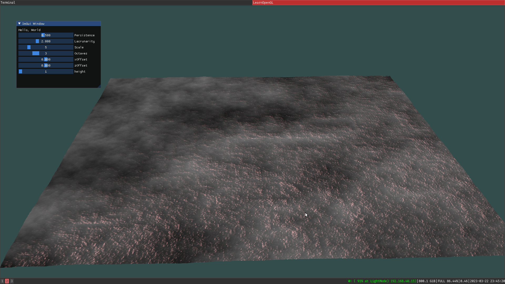

# Bonus 

Bonus project for an introduction to graphics module.

### Terrain Generation
Terrain generation using Perlin noise and shaders. 

The project was used for an introduction to graphics module and as a learning 
tool to learn how both OpenGL works and the basics of the graphics pipeline. 
Much of the code was created using learnOpenGL tutorials.
